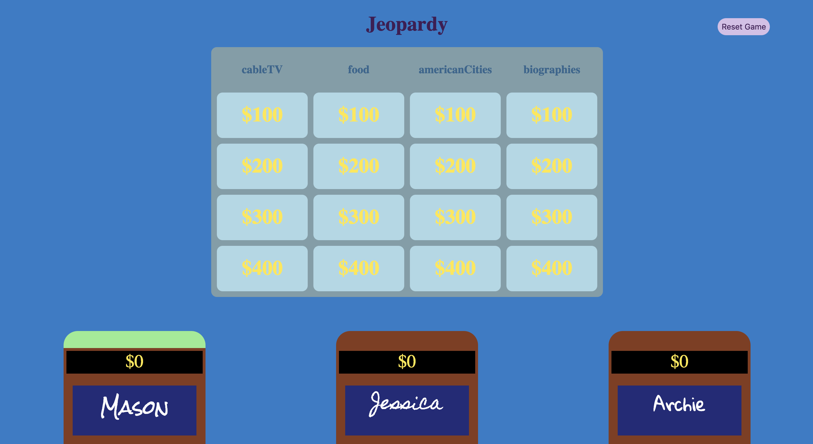

# Jeopardy!

Click here to play Jeopardy: https://jessicalyn.github.io/jeopardy/

## Goals
This is the first paired project for Module 2 at Turing School. The goal was to implement what we had learned about object oriented programing, webpack, and test driven development by creating a quiz game based on Jeopardy.

## Screenshot of board

## What we gained
There were a great deal of learning goals for this project, some we accomplished to a greater extent than others. The first challenge was to implement webpack. While using webpack makes certain things easier, it was the first time we had to connect a large amount of files, and we learned a great deal about structuring our files in a way that wouldn't loop back one another, tripping up our whole program.
Further, a challenge of this project was to find a strategy to make a selected clue box element from the DOM find the appropriate clue. This was a challenge as we had to match the selected element with a particular category, as well as a certain point value, to communicate which clue it should grab from our dataset. It was difficult to devise a plan to get the cluebox to see both of those things at the same time.
Finally, we ran into several unexpected issues that became learning points. An example is we had to recraft an event listener within an event listener as to not stack event listeners firing at once. 

## Collaborators
#### [Jessica Hansen](https://github.com/jessicalyn)
#### [Mason France](https://github.com/francepack)

